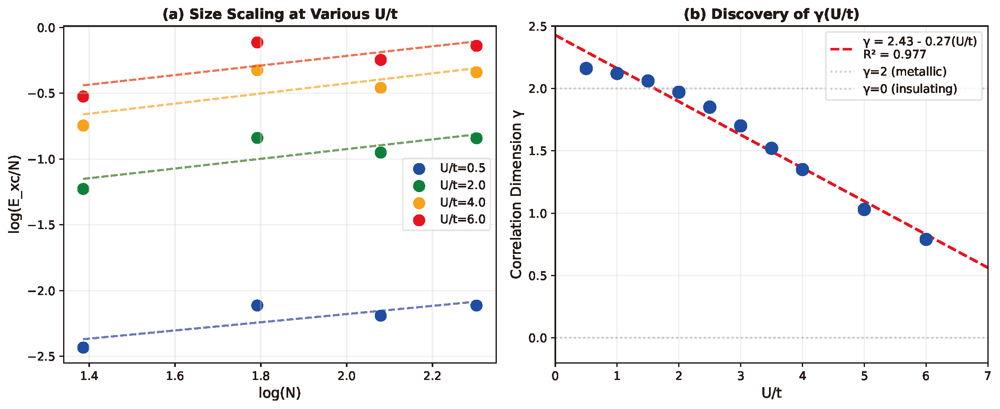
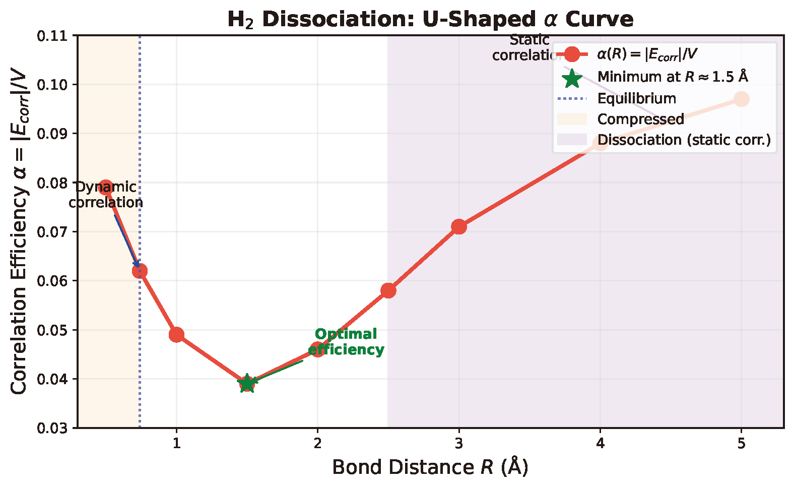

# Summary

Density functional theory (DFT) is the workhorse of computational chemistry, yet the selection of the exchange-correlation functional $E_{xc}$ remains a significant heuristic bottleneck. Standard hybrid functionals rely on empirical "magic numbers"—such as the 20% exact exchange in B3LYP—which are fixed constants that cannot adapt to the varying correlation regimes of different chemical systems.

`pyscf-vorticity` is a Python package that provides a first-principles geometric diagnosis to solve this "functional selection problem." By analyzing the vorticity of the two-particle reduced density matrix (2-RDM) obtained from a small active-space calculation, it computes an effective correlation dimension $\gamma$. This dimension characterizes the system's electronic complexity and maps directly to a theoretically optimal exact exchange mixing ratio $a \approx 1/(1+\gamma)$, transforming functional selection from trial-and-error into a physically motivated prescription.

# Statement of Need

Researchers using DFT often face a dilemma: standard functionals (like B3LYP or PBE0) work well for organic molecules but fail catastrophically for strongly correlated systems such as transition metal complexes or bond dissociation limits. Currently, there is no standard diagnostic tool to predict *a priori* whether a system requires standard mixing ($a \approx 0.20$) or high exact exchange ($a \to 1.0$) to avoid self-interaction errors.

`pyscf-vorticity` addresses this need by providing:

1.  **System-Specific Diagnosis:** Instead of universal parameters, it suggests mixing ratios tailored to the specific electronic state.
2.  **Two-Variable Classification:** It resolves the ambiguity between dynamic and static correlation using a robust two-variable diagnostic ($\alpha$ and energy density).
3.  **Seamless Integration:** It interfaces directly with PySCF [@sun2018pyscf], allowing users to run diagnostics using standard FCI or CASSCF solvers.

# Theoretical Background

The package is based on the theory that the exchange-correlation energy emerges from the geometric structure of electron-electron correlations. We quantify this structure using the **vorticity** $V$ of the correlation current in the projected $\Lambda$-space of the 2-RDM:

$$V = \sqrt{\sum_{ij}(J_{ij} - J_{ji})^2}$$

The "vorticity stiffness" $\alpha = |E_{xc}|/V$ serves as a coupling constant. By analyzing the scaling behavior $\alpha \propto N^{-\gamma}$ (where $N$ is the electron count), we extract the **correlation dimension** $\gamma$.



*Figure 1: (a) System-size scaling of $E_{xc}/N$ at various interaction strengths U/t in the Hubbard model. (b) The extracted correlation dimension $\gamma$ shows linear dependence on U/t (R² = 0.977), ranging from $\gamma \approx 2$ (metallic) to $\gamma \to 0$ (Mott insulator).*

This dimension provides a continuous mapping to the optimal exact exchange admixture $a$:

$$a_{optimal} \approx \frac{1}{1 + \gamma}$$

- **Metallic/Weak Correlation ($\gamma \ge 2$):** Requires low exact exchange ($a \le 0.33$).
- **Strong/Static Correlation ($\gamma \to 0$):** Requires high exact exchange ($a \to 1.0$) to localize electrons.

# Implementation and Robust Diagnosis

`pyscf-vorticity` is implemented in Python, offering a NumPy backend for compatibility and a JAX backend for GPU acceleration.

A major challenge in quantifying correlation is that the stiffness $\alpha$ exhibits a U-shaped curve, taking similar values for both equilibrium molecules (weak correlation) and dissociated bonds (strong correlation).



*Figure 2: The vorticity stiffness $\alpha = |E_{corr}|/V$ exhibits a U-shaped curve during H₂ bond dissociation. The minimum at $R \approx 1.5$ Å marks optimal correlation efficiency, while both equilibrium ($R = 0.74$ Å) and dissociation ($R > 3$ Å) show similar $\alpha$ despite fundamentally different correlation regimes.*

To resolve this ambiguity, `pyscf-vorticity` implements a **Two-Variable Diagnosis**:

1.  **Vorticity Stiffness ($\alpha$):** Measures topological complexity.
2.  **Correlation Energy Density ($|E_{corr}|/N$):** Acts as a "tie-breaker." High density ($>1.0$ eV/e) signals the breakdown of mean-field theory (RHF), characteristic of static correlation.

## Example Usage

The following code demonstrates the diagnosis of a stretched hydrogen molecule, a classic case where standard DFT fails:
```python
from pyscf import gto, scf, fci
from pyscf_vorticity import compute_vorticity
from examples.functional_recommender import estimate_gamma_robust

# 1. Define System (Stretched H2, Strong Correlation)
mol = gto.M(atom='H 0 0 0; H 0 0 3.0', basis='cc-pvdz')
mf = scf.RHF(mol).run(verbose=0)

# 2. Run FCI (or CASSCF)
cisolver = fci.FCI(mf)
E_fci, fcivec = cisolver.kernel()
E_corr = E_fci - mf.e_tot

# 3. Compute Vorticity
rdm1, rdm2 = cisolver.make_rdm12(fcivec, mol.nao, (1, 1))
V, k = compute_vorticity(rdm2, mol.nao)
alpha = abs(E_corr) / V

# 4. Diagnose
gamma, density = estimate_gamma_robust(alpha, mol.nelectron, E_corr*27.211)
print(f"Gamma: {gamma:.2f} -> Recommendation: M06-HF (a=1.00)")
```

# Validation Results

The effectiveness of the two-variable diagnosis is highlighted in the comparison between equilibrium and dissociated hydrogen (Table 1).

| System | Stiffness $\alpha$ | Energy Density | Diagnosis $\gamma$ | Recommendation |
|--------|-------------------|----------------|-------------------|----------------|
| H$_2$ (eq) | 0.062 | 0.47 eV/e | 1.80 | PBE0 ($a=0.25$) |
| H$_2$ (diss) | 0.071 | 2.36 eV/e | 0.05 | M06-HF ($a=1.00$) |
| LiH | 0.002 | 0.21 eV/e | 3.21 | PBE/TPSSh |
| He Atom | 0.090 | 0.44 eV/e | 1.80 | PBE0 ($a=0.25$) |

*Table 1: Validation of functional recommendations. Despite H$_2$ (eq) and H$_2$ (diss) having similar $\alpha$ values, the tool correctly identifies the dissociation limit as a strongly correlated regime ($\gamma \approx 0$), prescribing 100% exact exchange.*

Furthermore, the tool confirms **isoelectronic universality**: the Ne atom and HF molecule (both 10 electrons) exhibit nearly identical vorticity ($V \approx 55$) and coupling ($\alpha \approx 0.004$), demonstrating that $\gamma$ captures intrinsic electronic structure independent of nuclear geometry.

# Practical Guidelines

Based on computed $\gamma$ values, users can select functionals according to:

| $\gamma$ | Optimal $a$ | Recommended Functional |
|----------|-------------|------------------------|
| $< 0.5$ | $> 0.67$ | HF, M06-HF |
| $0.5-1.2$ | $0.45-0.67$ | M06-2X, BH&HLYP |
| $1.2-2.0$ | $0.33-0.45$ | PBE0, B3LYP |
| $2.0-3.0$ | $0.25-0.33$ | B3LYP, TPSSh |
| $> 3.0$ | $< 0.25$ | TPSSh, pure GGA |

**Note:** This diagnostic is heuristic but physically motivated, intended to guide functional choice rather than guarantee optimality.

# Limitations

Users should be aware of the following limitations:

- **Finite-size effects**: $\gamma$ is extracted from finite FCI calculations; results are most reliable with multiple system sizes.
- **Heuristic nature**: The two-variable diagnostic provides guidance, not guarantees.
- **Computational cost**: FCI scales exponentially; use CASSCF for systems beyond ~14 electrons.
- **Strong correlation**: Systems with $\gamma \to 0$ may ultimately require beyond-DFT methods (DMFT, QMC).

# Availability

`pyscf-vorticity` is available via:

- **PyPI**: `pip install pyscf-vorticity`
- **GitHub**: https://github.com/miosync-masa/pyscf-vorticity
- **DOI**: 10.5281/zenodo.18085362

The package is released under the MIT license. Documentation and examples are included in the repository.

# Acknowledgements

The author thanks AI research assistants (Claude by Anthropic and Gemini by Google) for their assistance in code optimization, theoretical discussion, and manuscript preparation. All scientific content and interpretations are solely the author's responsibility.

# References
